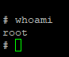
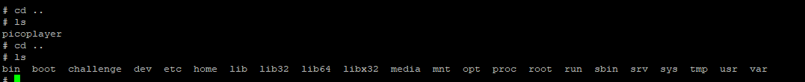
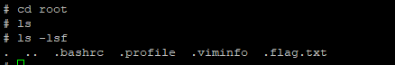
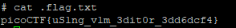

# Permissions

**Permissions (PicoCTF 2023):**

**Team: The\_Dream\_Team (6100 points) (160th place global)**

**Description:**

Can you read files in the root file?

The system admin has provisioned an account for you on the main server:

\<redacted>

Password: \<redacted>

Can you login and read the root file?

Hint 1: What permissions do you have?

Solution:

Checking out permissions using sudo -l (and entering our password), we find out that we have root access to the vi/vim text editor. We can use the Vim privilege escalation technique to get root access and access the flag file in the root directory.

.png>)

We can run vim as root user using sudo vi, for the privilege escalation. .png>)

Now that we are running Vim as root, and we can run command mode inside Vim by using :!sh and then pressing enter.

.png>)

As we can see now, we a shell with root access to the machine.

We can cd up a few directories now to find the directory for root. We can now cd into the root directory and look for files!

As we can see, there is a .flag.txt file here, which was initially hidden. Now we can do cat .flag.txt to read this file.

Now we can see the flag!

