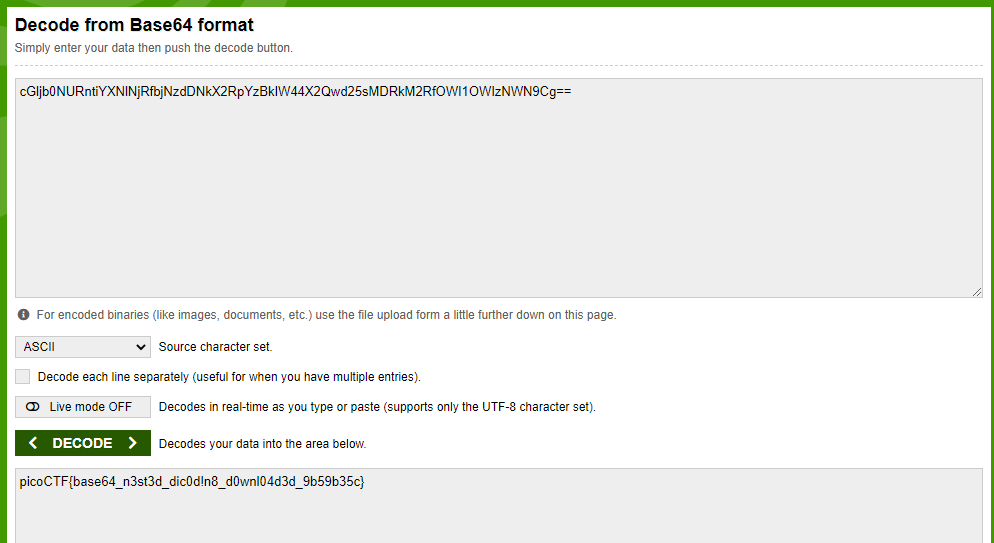

# repetitions

**repetitions (PicoCTF 2023):**

**Team: The\_Dream\_Team (6100 points) (160th place global)**

**Description:**

Can you make sense of this file?

Solution:

Opening up the file in using notepad or any other text editor gives you a base64 decoded string, recognizable by the two equal signs at the end.

.png>)

Entering this base64 string into [https://www.base64decode.org/](https://www.base64decode.org/) gives us another base64 string. After 6 times of decoding the string, we finally get the flag.

