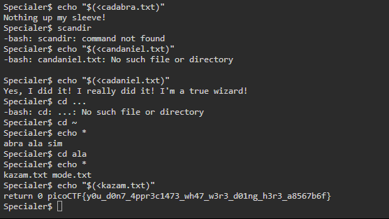

# Specialer

**Specialer (PicoCTF 2023):**

**Description:**

Reception of Special has been cool to say the least. That's why we made an exclusive version of Special, called Secure Comprehensive Interface for Affecting Linux Empirically Rad, or just 'Specialer'. With Specialer, we really tried to remove the distractions from using a shell. Yes, we took out spell checker because of everybody's complaining. But we think you will be excited about our new, reduced feature set for keeping you focused on what needs it the most. Please start an instance to test your very own copy of Specialer.

Solution:

Looking at the hints, I try out what commands I can use, and see that I can use cd. We can also use the pwd command to see what directory we are in, and we can use echo as well.

Looking around in the internet for how to see subdirectories with these commands, I realised we can run echo \* to find the subdirectories. Using this, we firstly move into the abra directory.

<figure><figcaption>
Command-Line
</figcaption></figure>

Looking at how to read files using echo, I find a stack overflow article showing how to read files using echo. Using this, I read the cadabra and cadaniel, with no luck. We cd back into the homer directory and now I start searching in the ala directory. We find the flag in the kazam.txt file.

<figure><figcaption>
Command-Line
</figcaption></figure>
